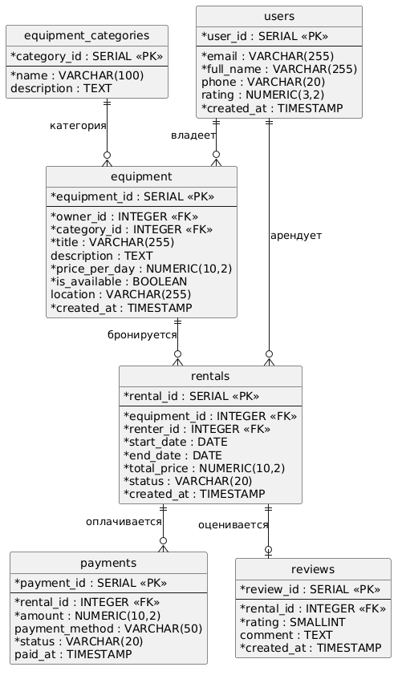

# Лабораторная работа №1. Проектирование реляционной модели данных

Дисциплина: Базы данных | Вариант 13 — **Сервис аренды спортивного инвентаря**

> 1. **Цель работы:**

Освоить методологию проектирования реляционных баз данных путем создания концептуальной и логической модели данных для заданной предметной области. Сформировать практические навыки разработки ER-диаграмм и их реализации на языке SQL.
> 2. **Задачи работы:**
1. Проанализировать предложенную предметную область и выделить ключевые сущности (не менее 4 сущностей).
2. Определить атрибуты сущностей и связи между ними (сущности должны находиться в 3NF).
3. Спроектировать ER-диаграмму в нотации PlantUML.
4. Реализовать модель данных в виде SQL DDL скрипта.
5. Обосновать выбранные типы данных и структуру таблиц.

> **Вариант 13 — Сервис аренды спортивного инвентаря:**

Платформа для аренды велосипедов, лыж, снаряжения для кемпинга и т.д. Владельцы инвентаря выставляют его в аренду. Арендаторы могут искать, бронировать и оплачивать аренду на определенные даты.

---

## ER-диаграмма



Исходный код: [`scripts/er_diagram.puml`](scripts/er_diagram.puml)

---

## Модель данных

Схема состоит из 6 таблиц:

| Таблица | Описание |
|---------|----------|
| `users` | Пользователи системы (владельцы и арендаторы) |
| `equipment_categories` | Справочник категорий инвентаря |
| `equipment` | Единицы инвентаря, выставленные в аренду |
| `rentals` | Бронирования и аренды |
| `payments` | Платежи за аренду |
| `reviews` | Отзывы арендаторов о единицах инвентаря |

---

### `users` — Пользователи

Хранит всех участников платформы. Один пользователь может быть как владельцем (выставляет инвентарь), так и арендатором (берёт в аренду). Роль определяется контекстом использования, но при необходимости можно ввести таблицу ролей.

| Поле | Тип | Описание |
|------|-----|----------|
| `user_id` | `SERIAL PRIMARY KEY` | Уникальный идентификатор |
| `email` | `VARCHAR(255) UNIQUE NOT NULL` | Email — уникальный логин |
| `full_name` | `VARCHAR(255) NOT NULL` | ФИО |
| `phone` | `VARCHAR(20)` | Телефон |
| `rating` | `NUMERIC(3,2)` | Средний рейтинг пользователя (0.00–5.00) |
| `created_at` | `TIMESTAMP NOT NULL DEFAULT NOW()` | Дата регистрации |

`email` — `VARCHAR(255)` по максимальной длине emai. `rating` — `NUMERIC(3,2)` для хранения дробных значений без погрешностей float.

---

### `equipment_categories` — Категории инвентаря

Справочник для нормализации: категории вынесены отдельно, чтобы не дублировать строки в `equipment`. Если бы мы добавили все поля в таблицу `equipment`, то получили бы транзитивную зависимость `equipment_id` -> `category_name` -> `category_description`, то есть `category_description` зависит не от первичного ключа `equipment_id` напрямую, а через `category_name`. Вынос в отдельную таблицу позволил это избежать и обеспечить 3NF.

| Поле | Тип | Описание |
|------|-----|----------|
| `category_id` | `SERIAL PRIMARY KEY` | Уникальный идентификатор |
| `name` | `VARCHAR(100) NOT NULL` | Название (велосипеды, лыжи, кемпинг...) |
| `description` | `TEXT` | Описание категории |

---

### `equipment` — Инвентарь

Единицы снаряжения, которые владельцы выставляют в аренду.

| Поле | Тип | Описание |
|------|-----|----------|
| `equipment_id` | `SERIAL PRIMARY KEY` | Уникальный идентификатор |
| `owner_id` | `INTEGER NOT NULL REFERENCES users` | FK на владельца |
| `category_id` | `INTEGER NOT NULL REFERENCES equipment_categories` | FK на категорию |
| `title` | `VARCHAR(255) NOT NULL` | Название (напр. «Горный велосипед Trek») |
| `description` | `TEXT` | Подробное описание |
| `price_per_day` | `NUMERIC(10,2) NOT NULL` | Цена аренды за сутки |
| `is_available` | `BOOLEAN NOT NULL DEFAULT TRUE` | Доступен ли сейчас |
| `location` | `VARCHAR(255)` | Город/адрес выдачи |
| `created_at` | `TIMESTAMP NOT NULL DEFAULT NOW()` | Дата добавления |

**Обоснование:** `price_per_day` — `NUMERIC(10,2)` исключает ошибки округления при денежных расчётах. При желании могли бы хранить просто копейки в типе INT и логику конвертации перенести в программную реализацию сервиса. `is_available` — `BOOLEAN` для быстрой фильтрации доступного инвентаря.

---

### `rentals` — Бронирования / Аренды

Центральная таблица: фиксирует факт аренды конкретной единицы инвентаря конкретным пользователем на заданные даты.

| Поле | Тип | Описание |
|------|-----|----------|
| `rental_id` | `SERIAL PRIMARY KEY` | Уникальный идентификатор |
| `equipment_id` | `INTEGER NOT NULL REFERENCES equipment` | FK на инвентарь |
| `renter_id` | `INTEGER NOT NULL REFERENCES users` | FK на арендатора |
| `start_date` | `DATE NOT NULL` | Дата начала аренды |
| `end_date` | `DATE NOT NULL` | Дата окончания аренды |
| `total_price` | `NUMERIC(10,2) NOT NULL` | Итоговая стоимость |
| `status` | `VARCHAR(20) NOT NULL DEFAULT 'pending'` | Статус: pending / confirmed / active / completed / cancelled |
| `created_at` | `TIMESTAMP NOT NULL DEFAULT NOW()` | Дата создания брони |

**Обоснование:** `start_date` / `end_date` — тип `DATE` (без времени), так как аренда считается посуточно. `status` — `VARCHAR(20)` с явным ограничением через `CHECK`, чтобы не плодить отдельную enum-таблицу для простого статуса.

---

### `payments` — Платежи

Платёж привязан к конкретному бронированию. Вынесен отдельно, т.к. одна аренда может иметь несколько платёжных операций (предоплата + доплата, возврат).

| Поле | Тип | Описание |
|------|-----|----------|
| `payment_id` | `SERIAL PRIMARY KEY` | Уникальный идентификатор |
| `rental_id` | `INTEGER NOT NULL REFERENCES rentals` | FK на бронирование |
| `amount` | `NUMERIC(10,2) NOT NULL` | Сумма платежа |
| `payment_method` | `VARCHAR(50)` | Способ оплаты (card, sbp, cash...) |
| `status` | `VARCHAR(20) NOT NULL DEFAULT 'pending'` | Статус: pending / paid / refunded |
| `paid_at` | `TIMESTAMP` | Время проведения платежа |

**Обоснование:** Если не выделять платеж из таблицы `rentals`, то получим повторающиеся группы платежей (payment1, payment2, ...) и для добавления нового платежа придется менять схему таблицы. Либо же, поместив все платежи в одной ячейке в виде строки, усложнии бы поиск по таблице. Отделение платежей от аренды позволило обеспечить 1NF корректно обрабатывать, например, частичные возвраты. `paid_at` — `TIMESTAMP` (с временем, не только датой) для логирования.

---

### `reviews` — Отзывы

Арендатор оставляет отзыв о единице инвентаря после завершения аренды. Привязка к `rental_id` гарантирует, что отзыв может оставить только фактический арендатор.

| Поле | Тип | Описание |
|------|-----|----------|
| `review_id` | `SERIAL PRIMARY KEY` | Уникальный идентификатор |
| `rental_id` | `INTEGER NOT NULL UNIQUE REFERENCES rentals` | FK на аренду (один отзыв на аренду) |
| `rating` | `SMALLINT NOT NULL` | Оценка от 1 до 5 |
| `comment` | `TEXT` | Текст отзыва |
| `created_at` | `TIMESTAMP NOT NULL DEFAULT NOW()` | Дата отзыва |

**Обоснование:** `rating` — `SMALLINT` занимает 2 байта вместо `INTEGER` 4 байта — достаточен для диапазона 1–5, экономит место. `UNIQUE` на `rental_id` — один отзыв на одну аренду.

---

## Связи между таблицами

```
users ──< equipment          (один владелец → много единиц инвентаря)
users ──< rentals            (один арендатор → много бронирований)
equipment_categories ──< equipment  (одна категория → много единиц)
equipment ──< rentals        (одна единица → много бронирований)
rentals ──< payments         (одно бронирование → несколько платежей)
rentals ──|| reviews         (одно бронирование → один отзыв)
```

---

## Индексы

PostgreSQL автоматически создаёт индексы только для `PRIMARY KEY` и `UNIQUE`-ограничений. Внешние ключи (FK) — нет. Добавляем индексы на колонки, участвующие в самых частых запросах.

| Индекс | Таблица | Колонка | Зачем |
|--------|---------|---------|-------|
| `idx_equipment_owner` | `equipment` | `owner_id` | Список объявлений владельца («мой инвентарь») |
| `idx_equipment_available` | `equipment` | `is_available` | Поиск доступного инвентаря — самый частый запрос |
| `idx_rentals_equipment` | `rentals` | `equipment_id` | Проверка пересечения дат при новом бронировании |
| `idx_rentals_renter` | `rentals` | `renter_id` | История аренд пользователя |

---

## Нормальные формы (обоснование 3NF)

| НФ | Выполнение |
|----|-----------|
| **1NF** | Все атрибуты атомарны, нет повторяющихся групп |
| **2NF** | Все не-ключевые атрибуты зависят от всего первичного ключа (все PK — `SERIAL`) |
| **3NF** | Нет транзитивных зависимостей: категория вынесена в `equipment_categories`, платежи — в `payments` |
